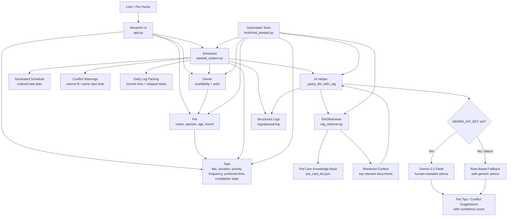
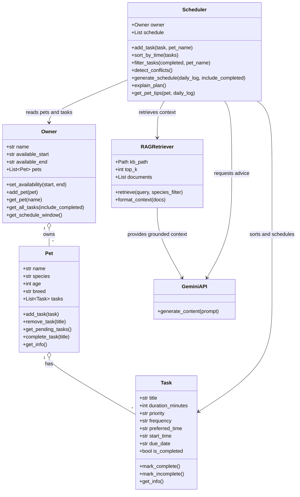
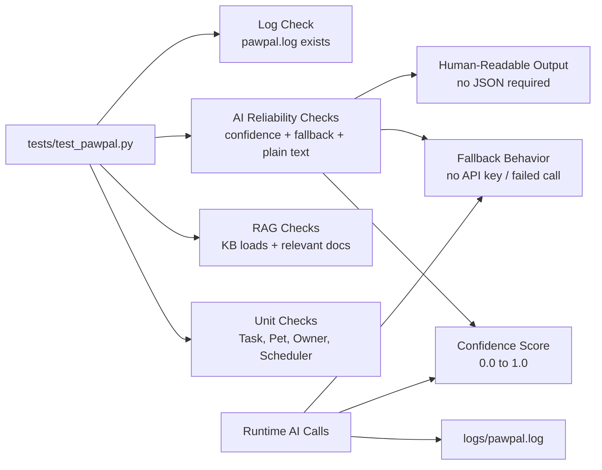

# PawPal+ Updated System Diagram

This diagram reflects the current codebase: Streamlit UI, domain model, scheduler, RAG retriever, Gemini AI path, rule-based fallback, logging, and tests.

## Runtime Architecture

## Core Class Relationships

## Reliability And Observability

